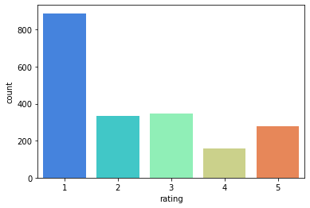
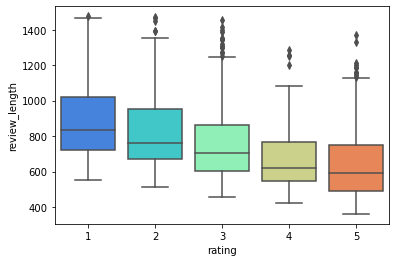
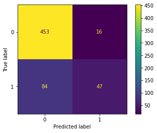
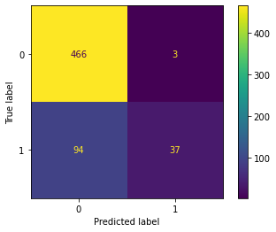
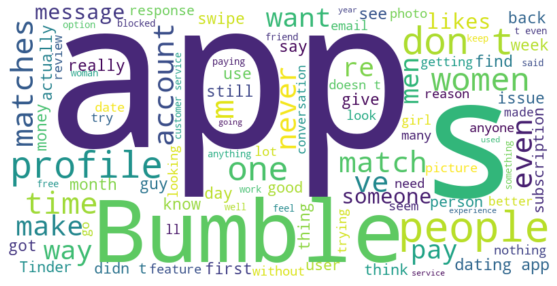
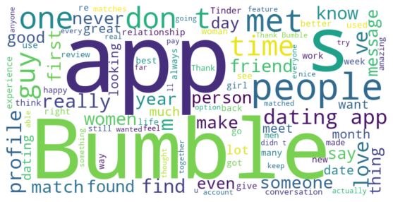

# What does Naive Bayes know about (Bumble) dating reviews? - NLP
- I explored 2000 Bumble dating reviews from the Apple app store for this project. I wanted to develop a model that is able to determine if a particular review of the app is good or bad. In this project, I decided that a good review was four or more and a bad review was less than four. I also wanted to see which words occurred the most for different ratings.
- I started by doing exploratory data analysis using Python libraries such as Seaborn, Matplotlib, Pandas and NumPy. I initially worked out how many 1, 2, 3, 4 and 5-star reviews are in the dataset.
- This is easy to do using Python. As we see in this first diagram, there are several 1-star reviews in this data set. I take this into account when considering the accuracy of the model later.

- Before using Natural Language Processing, I wanted to see if the length of the title or review had a correlation with the rating. I decided to introduce two new columns to the data frame. They are the review length and the title length columns. If you look at the word count of the reviews for the different ratings, you can see that reviews with lower ratings are typically longer. The box plot below shows just this. It is also the case that the titles are slightly longer for reviews with lower ratings; however, the correlation for this is weaker than for the review length.

- The first model that I use here is Naive Bayes.
- Before starting to make the model I first made a new column which is a 1 if the review is 4 or more and 0 if the review is less than 4.
- To make the model I started by using sklearn's CountVectorizer which I fitted and transformed to the reviews variable.
- Then using sklearn's train test split and MultinomialNB I was able to predict if a review was good or not.
- This model has an accuracy of **0.83**. This is better than if we had made the guess that all the reviews are bad which has an accuracy of 0.78.
- Below is the confusion matrix for the Naive Bayes model. 

- The second model I tried out is a random forest classifier.
- For this model, I also imported stopwords from nltk and string. I used these to make a function to remove punctuation and stopwords from the reviews. I thought that this might improve the accuracy of the model.
- Then I imported the TfidfTransformer, the Pipeline and the RandomForestClassifier from sklearn.
- Once I fitted and predicted using the model, the classification report gave the model an accuracy of **0.84**, slightly higher than the previous model.
- Below is the confusion matrix for the random forest classifier model. Note that this model in comparison to the previous model is more likely to classify good reviews as bad reviews.

- Using a word cloud I can find the most popular words for different ratings.
- The first word cloud here is for reviews with a rating of 1 star.

- The second word cloud here is for reviews with a rating of 5 stars.

- If I spent more time on this project, I would look into improving the different model's performances by adding additional features like the length of the review and title. I would also use the same models but replace the review text with the title text.
- Additionally, I would do a more sophisticated word count as this would be beneficial from a business intelligence point of view to understand what people like and dislike about the app. Knowing this could help Bumble improve certain aspects of the app that would improve their reviews and the overall performance of Bumble in the dating app market.
